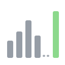
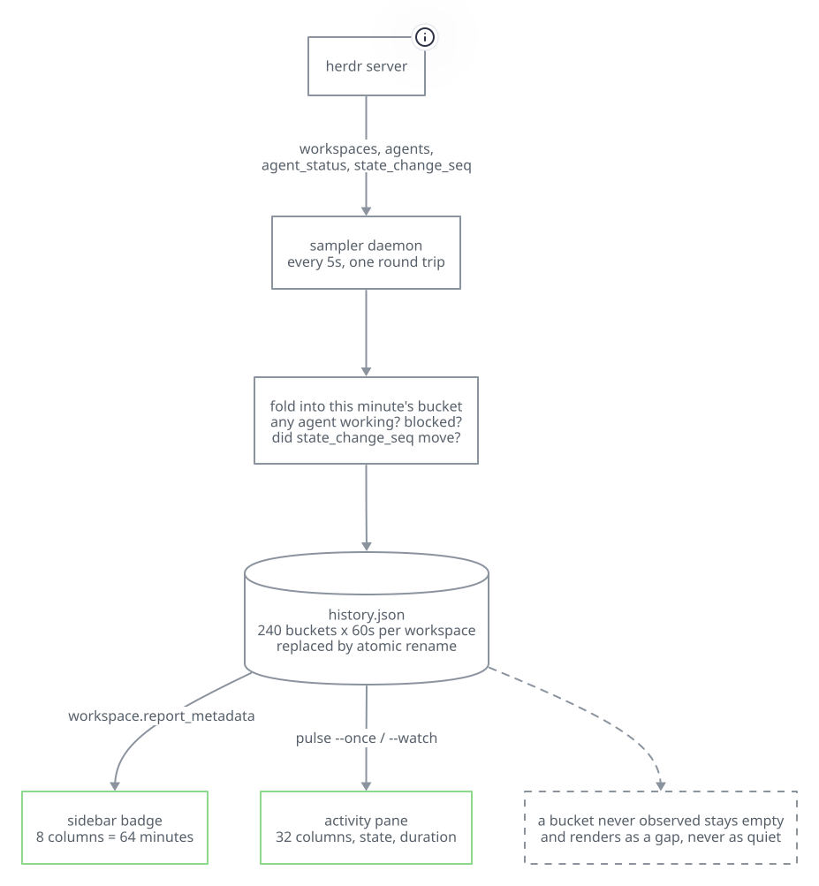

# pulse

Per-workspace agent activity history for [herdr](https://github.com/herdr).

herdr's sidebar tells you what an agent is doing *right now*. It does not tell
you the shape of the last hour, so between two glances a wedged agent and a busy
one look exactly the same. pulse samples every agent's lifecycle state on an
interval, records a bounded history, and draws a sparkline next to each
workspace:

> **Which of these actually did anything in the last hour, and which have been
> idle since lunch?**

<p align="center">
  
</p>

## The one rule worth knowing

A gap column is **not** a quiet column.

| Glyph | Meaning |
|---|---|
| `▁▂▃▄▅▆▇█` | Observed activity, low to high |
| `·` | Observed, and nothing happened |
| `╌` | **Not observed** — the sampler was not running then |

"We were not watching" and "nothing happened" are different facts. pulse never
draws one as the other; a stopped sampler leaves a visible hole in the history
rather than a convincing stretch of calm.

The gap is a printing character rather than a blank for a reason that is not
cosmetic: herdr trims whitespace off a badge token's value and deletes a token
whose value is entirely whitespace. With a space, the *newest* columns of a
sparkline were silently stripped, so the series stopped lining up with the
present — and a workspace nobody had been watching lost its badge altogether,
which is the one moment the gap most needed showing.

## What it looks like

A real `pulse --once`, captured from a running session. Only the workspace labels
have been renamed; every glyph, column and number is as the plugin printed it.

```
pulse — 19 workspaces — 23:32:18 UTC

workspace           activity                            state          for  seen  agents
web-api             [╌╌╌╌╌╌╌╌╌╌╌╌╌╌╌╌╌╌╌╌╌╌╌╌╌·▃·····]  ? unknown      35m  3s    0
research            [╌╌╌╌╌╌╌╌╌╌╌╌╌╌╌╌╌╌╌╌╌╌╌╌╌·······]  ? unknown      ?    3s    0
planner             [╌╌╌╌╌╌╌╌╌╌╌╌╌╌╌╌╌╌╌╌╌╌╌╌╌·······]  ? unknown      32m  3s    0
media-fix           [╌╌╌╌╌╌╌╌╌╌╌╌╌╌╌╌╌╌╌╌╌╌╌╌╌·······]  - idle         ?    3s    2
budget-fix          [╌╌╌╌╌╌╌╌╌╌╌╌╌╌╌╌╌╌╌╌╌╌╌╌╌·······]  = done         ?    3s    2
shear               [╌╌╌╌╌╌╌╌╌╌╌╌╌╌╌╌╌╌╌╌╌╌╌╌╌▆▆▇▆▆▂·]  = done         11m  3s    1
redact              [╌╌╌╌╌╌╌╌╌╌╌╌╌╌╌╌╌╌╌╌╌╌╌╌╌▆▆▆▆▆▆▆]  > working      ?    3s    3
collide             [╌╌╌╌╌╌╌╌╌╌╌╌╌╌╌╌╌╌╌╌╌╌╌╌╌▆▆▆▆▆▆▆]  > working      ?    3s    5
standup             [╌╌╌╌╌╌╌╌╌╌╌╌╌╌╌╌╌╌╌╌╌╌╌╌╌▆▆▇▇▆▆▅]  ! blocked      14m  3s    4
pulse               [╌╌╌╌╌╌╌╌╌╌╌╌╌╌╌╌╌╌╌╌╌╌╌╌╌▆▆▆▆▆▆▆]  > working      ?    3s    5
app                 [╌╌╌╌╌╌╌╌╌╌╌╌╌╌╌╌╌╌╌╌╌╌╌╌╌·······]  ? unknown      ?    3s    0
repo                [╌╌╌╌╌╌╌╌╌╌╌╌╌╌╌╌╌╌╌╌╌╌╌╌╌╌╌╌····]  ? unknown      ?    3s    0
label-probe         [╌╌╌╌╌╌╌╌╌╌╌╌╌╌╌╌╌╌╌╌╌╌╌╌╌╌╌╌·╌╌╌]  ? was unknown  ?    24m   0

legend  ▁▂▃▄▅▆▇█ busier  |  · observed, nothing happened  |  ╌ not observed
        for = how long the state had held when last seen  |  seen = how long ago that was
        "was X" is the last observation and nothing has been seen since — not a claim about now
        one column = 7m  |  whole row = 3h44
```

Four things worth reading off that:

- **`standup` is `! blocked`** — one of its four agents is waiting on a human
  while the others finish. That workspace will not make progress until somebody
  looks at it, and it is the only row where that is true.
- **`shear` is winding down.** `▆▆▇▆▆▂·` is a busy stretch that tailed off; the
  state caught up a moment later and says `= done`.
- **The leading `╌` are honest.** The sampler had been running for about half an
  hour when this was taken, so most of the four-hour row is time nobody watched —
  drawn as gaps, not as calm.
- **`label-probe` says `was unknown`, `seen 24m`.** Nothing has been observed
  there for 24 minutes, so the row refuses to make a present-tense claim, and its
  newest columns are gaps rather than quiet.

In the sidebar each workspace gets the compact form — eight columns over the last
64 minutes, plus the state glyph:

```
standup   ╌╌▆▇▇▆▆▅!
collide   ╌╌▆▆▆▆▆▆>
budget    ╌╌······=
```

## Install

```sh
herdr plugin install moneycaringcoder/herdr-pulse
```

For local development, from a checkout:

```sh
cargo build --release      # herdr plugin link does NOT build for you
herdr plugin link .
```

`herdr plugin link` only registers the directory. If you skip the build step
there is no `target/release/pulse` for herdr to run, and every verb fails.

## Sidebar setup

herdr only renders a plugin's custom tokens if your `config.toml` names them.
pulse contributes three, one per severity, because herdr renders a token's value
as flat text and cannot colour by content:

| Token | Lit when |
|---|---|
| `$pulse_blocked` | At least one agent is waiting on a human |
| `$pulse_working` | At least one agent is working |
| `$pulse_quiet` | Nothing working, nothing blocked |

Run this and it is done for you:

```sh
pulse --setup
```

It splices the entries into your existing `[ui.sidebar.spaces]` rows, takes a
backup at `config.toml.pulse-backup` first, reloads herdr's config, and restores
the backup automatically if that reload fails. Running it twice is a no-op.
`pulse --setup-rollback` undoes it.

To do it by hand instead, add the three entries inside a row of your
`[ui.sidebar.spaces]` rows array:

```toml
[ui.sidebar.spaces]
rows = [
  ["state_icon", "workspace"],
  ["branch",
    { token = "$pulse_blocked", fg = "#FF8080" },
    { token = "$pulse_working", fg = "#8CD98C" },
    { token = "$pulse_quiet",   fg = "#8A8A8A" },
  ],
]
```

The entries have to land **inside** a row, not between two rows. A bare table
dropped beside a row is still valid TOML, so herdr accepts the file and then
renders nothing at all.

## Usage

Start the sampler once; it survives herdr restarts.

```sh
pulse --enable
pulse --once
```

### Reporting

| Verb | What it does |
|---|---|
| `--once` | Print a one-shot activity report and exit. The default when no verb is given. |
| `--week` | Print a one-shot week view and exit. One column is six hours; the row covers seven days. |
| `--json` | Print the recorded history as JSON and exit. Gaps are `null`, observed-and-quiet is `0`. |
| `--watch` | Live activity view, refreshing on an interval. Exits with a message if no sampler is running. |

### Reading the pane

`--once`, `--week` and `--watch` always print one aggregate row per workspace:

| Column | Meaning |
|---|---|
| `workspace` | The workspace's label. |
| `activity` | The sparkline, oldest column on the left, newest on the right. |
| `session` | When the herdr session that recorded this row started listening. Parenthesised — `(20:53)` — for a session other than the one running now, `(?)` when that session's start time is unknown, and `?` when it is unknown and there is no live session to compare it to. With no live session at all — herdr not running — no row is marked as earlier than anything. |
| `state` | The state the workspace was in **at the last observation**. |
| `blocked` | The estimated blocked duration alone. It is `?` when the sampler watched none of the row; the legend says the estimate covers time actually watched, not the whole row. |
| `for` | How long that state had held when we last looked. |
| `seen` | How long ago that observation was. |
| `agents` | Agents in the workspace at that observation. |

`--since <WINDOW>` narrows the history read by `--once`, `--watch`, `--json`
and `--week`. Each ring answers in its own units: the fine ring uses
`bucket_seconds`, while `--week --since 2d` draws two days of the hourly ring.
It is a reading setting and never changes what the sampler records, so there is
no config-file key for it. If the window reaches past retention, pulse says on
standard error that the pane starts where the recorded history does; the time
before it is not drawn as quiet. If the window is narrower than one bucket,
pulse draws one bucket and says that there is no finer resolution recorded.

`--agents` governs *recording*, not display: it tells the sampler to keep a
separate ring per agent. The panes then draw one indented line per recorded
agent under its workspace whenever those rings exist, whether or not the switch
is repeated on the reading command — the rings are what there is to draw. The
sidebar badge still keeps its single aggregate line, and `--week` stays
aggregate-only because agent rings are recorded at the fine ring's resolution
only.

If an agent first appears partway through the window, the earlier columns are
gaps: the line reads as absent-then-present, never as quiet-then-active. Turning
recording off drops the rings rather than freezing them, so a line cannot age
into a sparkline of gaps that nothing explains.

Every state in the pane is a past observation. While the sampler is running the
last observation is seconds old, so reading it as the present is fair and the row
says `> working`. Once the last observation is older than three sampling
intervals — because the sampler stopped, or the machine slept — the row switches
to the past tense:

| Row reads | Means |
|---|---|
| `> working` | An agent is working, as of a moment ago. |
| `> was working` | An agent was working when we last looked, `seen` ago. Nothing is claimed about now. |

The sparkline says the same thing in glyphs: a stretch of `╌` is time nobody
watched. The words and the sparkline are never allowed to disagree.

Pane views put a `^` marker line directly under each workspace and
recorded-agent sparkline, aligned column for column. The legend calls it
`busiest observed changes, not every change`: each row marks at most three
columns, choosing the highest observed transition counts and breaking ties
toward the most recent column. This keeps the annotation readable instead of
drawing under every eligible column. The single-line sidebar badge has no
marker line.

A gap column is never marked, and pulse never infers a transition between
watched columns on opposite sides of a gap. Doing that would invent the moment
the state changed.

The pane's `blocked` cell shows the estimated duration alone. Its `?` means
nothing in the row was watched, not that zero blocking was observed. The legend
therefore says the figure is estimated over time actually watched rather than
over the whole row. For each observed bucket, pulse multiplies the bucket
duration by blocked samples divided by all samples, then rounds. A gap
contributes to neither blocked nor watched time, because unobserved time is not
time with no blocking in it. A reader wanting the ratio can take
`blocked_seconds` over `watched_seconds` from `--json`.

When no sampler is live, `--once`, `--week` and `--watch` print a line on
standard error naming why the last run stopped and, when known, how long ago.
The four explanations are disabled, terminated, ended unexpectedly (with detail
where one was recorded), and stopped for an unknown reason. Unknown is said
plainly, never dressed up as a clean exit. While a sampler is live there is no
stop to explain; a gap then means herdr was unreachable.

`--json` carries the same distinction, since a consumer cannot read a tense:
each workspace has `last_seen`, `observed_ago_seconds` and `state_is_current`,
and the document has the `staleness_tolerance_seconds` those were judged
against.

Each workspace also has `blocked_seconds` and `watched_seconds`, both covering
exactly the window in `series`. The former is the blocked-time estimate; the
latter is how many seconds of that window the sampler actually observed. They
must be read together so the estimate is not mistaken for a measurement across
the whole window. A gap contributes to neither field.

`--json` exposes the same evidence in arrays aligned oldest-first,
column-for-column with the activity arrays: each workspace has `transitions`
beside `series` and `week_transitions` beside `week`, and each nested agent has
`transitions` beside its `series`. A positive number is the observed state-change
count, `0` means watched with no change, and `null` means nobody watched. A
consumer must not bridge `null` entries to infer a change.

The `--json` document carries `"schema_version": 1` at its top level, and also a
top-level `sampler` object with `running` and `stopped`. Inside `stopped`, the
fields are `reason`, `at` and `detail`; `reason` is one of `disabled`,
`terminated`, `failed` or `unknown`. That version is the consumer contract for
the document's shape and field meanings; the
[versioned JSON schema](docs/json-schema.md) lists every field and the
load-bearing `null`-versus-`0` rule.

### Sessions are not spliced together

herdr's workspace ids, pane ids and state-change counter are all scoped to one
run of the server, so nothing recorded under one session can be compared with
anything recorded under another. pulse therefore keeps one series per session and
labels each with the `session` column, rather than appending them into a single
timeline that would imply an unbroken watch across a restart. A workspace that
has been watched by two sessions gets two rows, and each row's sparkline covers
only the minutes that session observed.

The earlier session's bars are still real observed history and are still drawn:
the seam is marked, never blanked. Blanking it would say "nobody was watching",
which is the one thing this plugin refuses to say when somebody was.

herdr publishes no session identity — there is no session id, start time or boot
counter anywhere in `session.snapshot` — so pulse fingerprints the socket it read
the snapshot from. That can split one session in two if the socket is ever
re-bound under a live server; it cannot merge two sessions into one, which is the
error that would matter. `--json` carries the fingerprint, the session's start
time, and `is_current` per workspace, plus the live session at the top level.

### Sampler

| Verb | What it does |
|---|---|
| `--enable` | Start the background sampler, detached from herdr. |
| `--disable` | Stop it and clear every badge this plugin set. |
| `--supervise` | Start the sampler at login, under systemd or launchd. |
| `--unsupervise` | Remove that supervision (history is kept). |
| `--toggle` | Stop it if running, otherwise start it. |
| `--restore` | Restart it only if it was enabled. herdr's startup hook; silent otherwise. |
| `--daemon` | Run the sampler in the foreground. Internal; `--enable` uses it. |

### Supervision

Supervision is opt-in: pulse writes nothing until you run `pulse --supervise`.

On Linux it writes a systemd user unit named `dev.herdr.pulse.sampler.service`,
into whichever per-user directory the running user manager reports in
`systemctl --user show --property=UnitPath`, falling back to
`~/.config/systemd/user` when there is no manager to ask. It asks rather than
deriving the path because a user manager is started by logind before any shell
exists and never sees an `XDG_CONFIG_HOME` set in a shell rc — a unit written
where that variable points would sit on disk in a directory systemd does not
read. It then activates the unit with:

```sh
systemctl --user daemon-reload
systemctl --user enable --now dev.herdr.pulse.sampler.service
```

On macOS it writes
`~/Library/LaunchAgents/dev.herdr.pulse.sampler.plist`, then activates it with:

```sh
launchctl enable "gui/$(id -u)/dev.herdr.pulse.sampler"
launchctl bootout "gui/$(id -u)/dev.herdr.pulse.sampler"   # clears a stale copy
launchctl bootstrap "gui/$(id -u)" "$HOME/Library/LaunchAgents/dev.herdr.pulse.sampler.plist"
```

Other platforms do not support supervision; pulse says that it is available on
Linux and macOS only and that `pulse --enable` still runs the sampler until the
machine stops.

The installed definition runs `pulse --daemon`. At install time it writes the
resolved `HERDR_PLUGIN_STATE_DIR` and `HERDR_SOCKET_PATH` values in full and
bakes in the recording flags passed to `--supervise`: `--interval`,
`--bucket-seconds`, `--retention-buckets`, `--columns` and `--agents`. A
supervisor starts the sampler with neither environment variable set. Baking both
paths in keeps the sampler writing the history that the panes read even if one
of those variables later changes. Before installing the definition, pulse stops
any unsupervised sampler already running so that two processes cannot overwrite
the same history file.

Once supervision is installed, `--enable` starts the unit. `--disable` first
runs `systemctl --user disable --now`, or `launchctl bootout` followed by
`launchctl disable`, and then stops the sampler and clears its badges. Both
halves matter on macOS: `bootout` unloads the agent for this session, and only
`disable` keeps launchd from loading the plist again at the next login. The
definition stays on disk either way, so a later `--enable` starts it again
without a reinstall. `--restore` becomes a no-op because the supervisor owns the
process. Run `pulse --unsupervise` to stop the unit and delete its definition;
recorded history is left untouched.

Supervision does not change what pulse records or how a gap is judged. Every
bucket the sampler did not observe stays a gap, restart or no restart: stop the
unit for half an hour and the row draws half an hour of gap glyphs. Downtime
shorter than one bucket leaves that bucket observed, because it was — the
sampler saw part of it, and a bucket with any observation in it is real data.
Continuity of the unit is not continuity of observation.

### History

| Verb | What it does |
|---|---|
| `--forget` | Delete the recorded history and start over. |

### Sidebar setup

| Verb | What it does |
|---|---|
| `--setup` | Add pulse's tokens to herdr's `config.toml` and reload. |
| `--setup-rollback` | Restore the `config.toml` backup taken by `--setup`. |

### Other

| Option | What it does |
|---|---|
| `--interval <SECS>` | Seconds between snapshots (default 5). |
| `--bucket-seconds <SECS>` | Wall clock per history bucket (default 60). |
| `--retention-buckets <N>` | Buckets retained per workspace (default 240). |
| `--columns <N>` | Sparkline columns in the badge (default 8). |
| `--since <WINDOW>` | Narrow the pane views: 90s, 30m, 2h, 3d (default: all). |
| `--agents` | Record separate per-agent rings, used by `--once` and `--watch`. Off by default. |
| `--version` | Print version and exit. |
| `--help` | Show help. |

Options may appear before or after the verb: `pulse --interval 10 --once` and
`pulse --once --interval 10` are the same command.

## Configuration

Settings live at:

```
~/.config/herdr/plugins/config/moneycaringcoder.pulse/config.json
```

Every key is optional — a partial file overrides only what it names, and unknown
keys are ignored. A missing file is normal. A malformed one is reported on
stderr and the defaults are used, because a typo should not stop your badges
from rendering.

| Key | Default | Range | Meaning |
|---|---|---|---|
| `interval_seconds` | `5` | 1–3600 | Seconds between snapshots of herdr's session. |
| `bucket_seconds` | `60` | 10–3600 | Wall clock each history bucket covers. |
| `retention_buckets` | `240` | 8–10000 | Buckets kept per workspace. Fixed-length ring; never grows. |
| `badge_columns` | `8` | 1–64 | Sparkline columns in the sidebar badge. |
| `badge_window_minutes` | `64` | 1–1440 | Minutes of history those columns span. |
| `max_workspaces` | `64` | 1–512 | Ceiling on tracked workspaces; least recently seen are evicted first. |
| `per_agent_series` | `false` | `true` / `false` | Record separate per-agent rings, used by `--once` and `--watch`. |

Command-line options override the file. `--agents` is the command-line form of
`per_agent_series`; for example, `pulse --agents --enable` starts a sampler that
records the agent rings. This is a recording setting, not a display-only toggle:
the sampler only keeps separate agent history while it is on.

Per-agent recording is deliberately off by default. Each agent ring is as long
as the fine ring, and a workspace may retain up to four of them, evicting the
least recently seen agent first. Those rings multiply both the workspace's
on-disk cost and the history rewritten on every sampling cycle.

Every value is clamped into its range, so no configuration can produce output
the renderer has to defend against. The ranges and per-agent recording interact,
and pulse says so rather than quietly obeying:

- **All stored rings across `max_workspaces` are capped at 65,536 buckets.**
  `Config::clamp` counts each workspace's fine ring, fixed 168-bucket week ring
  and, when per-agent recording is on, up to four more rings the length of the
  fine one. When the configured workspace ceiling would exceed the bucket cap,
  the workspace ceiling gives way and the reason is printed on stderr.
  `retention_buckets` wins because it is your explicit statement about how far
  back you want to see.
- **The badge never asks for more history than the ring holds.** `--bucket-seconds
  10` with the default 64-minute window would want 384 buckets from a 240-bucket
  ring, leaving three columns permanently gapped on a workspace that was in fact
  watched the whole time. The window is shortened to fit instead, because a gap
  has to mean "nobody was watching" and not "the arithmetic did not line up".

```json
{
  "interval_seconds": 5,
  "bucket_seconds": 60,
  "retention_buckets": 240,
  "badge_columns": 8,
  "badge_window_minutes": 64,
  "max_workspaces": 64,
  "per_agent_series": false
}
```

State — the recorded history and the sampler's markers — lives separately, at
`~/.local/state/herdr/plugins/moneycaringcoder.pulse/`.

## Why these numbers

**60-second buckets.** The bucket size is chosen against the question, not
against the sampling rate. A minute is fine enough that a two-minute burst
appears as its own step in the sparkline, and coarse enough that an hour of
history fits into a handful of columns. At the default 5-second interval, twelve
samples land in each bucket, so a bucket can distinguish activity to about 8%.

**240 buckets = 4 hours.** Enough to cover "since lunch", which is the longest
span anyone asks this question about. The ring is allocated at this length and
never grows, so the history file's size has a ceiling that does not depend on
uptime.

**168 hourly buckets = 7 days.** The configurable fine ring answers what
happened over the last few hours; the fixed week ring answers whether a
workspace did anything yesterday, or at any other point this week. Both record
the same samples. The week ring is not derived by folding the fine ring because,
at the defaults, those minute buckets have aged out after four hours. Its
one-hour buckets and 168-bucket width are not configurable, so "the week" always
means exactly seven days.

**8 workspaces × (240 fine + 168 week) buckets ≈ 180 KB.** That is the measured
history-file size at the defaults. The week ring accounts for
`168 / (240 + 168) ≈ 41%`, roughly 40%, of the file.

**Per-agent recording: 240 fine + 168 week + up to 4 × 240 agent buckets =
1,368 buckets per workspace.** `Config::clamp` counts all of them against the
65,536-bucket ceiling. At the defaults, enabling the agent rings therefore
reduces the tracked-workspace cap from 64 to
`floor(65,536 / 1,368) = 47`; the clamp prints that reduction and its reason.

**8 badge columns over 64 minutes = 8 minutes per column.** Sidebar cells are
narrow; eight columns plus a state glyph is about as much as fits before herdr
starts eliding. 64 minutes divides evenly by 8 and still reads as "the last
hour". The `--once` and `--watch` panes are not so constrained and draw the
full fine-ring retention across 32 wider columns; `--week` draws its fixed ring
across 28 columns instead.

Eight is a choice, not a measurement, and it stays one: herdr 0.8.0 / protocol 19
exposes no sidebar or badge width anywhere, so a wider badge would mean guessing
how much room there is. The [protocol
notes](docs/herdr-protocol.md#what-the-protocol-does-not-expose-the-width-a-badge-has)
record what was checked. Use `--columns <N>` if your sidebar is wider than the
tightest case this assumes.

**5-second sampling.** One snapshot of a live 10-workspace, 18-agent session
measured 12.7 ms and 34 KB on the wire, so a 5-second interval is a 0.25% duty
cycle — cheap enough that the finer resolution is worth having.

## Costs and caveats

- The sampler is a detached background process. It keeps running after herdr
  exits until you run `pulse --disable`.
- Badges are pushed with a TTL of three refresh cycles, so they self-clear if the
  sampler is killed rather than lingering as stale claims.
- herdr's workspace ids are session-scoped and can be reused. History is keyed on
  the workspace's checkout path where herdr reports one, so a series survives an
  id it shares with somebody else tomorrow. A workspace with no worktree has no
  such key: for those, a label that changes under an id is treated as a different
  workspace and the recorded buckets are dropped rather than attributed to it —
  an empty sparkline is a visible loss, a wrong one is not.
- A series belongs to one herdr session and is never appended to another's. A
  restart therefore starts a new row rather than extending the old one, and the
  badge — which has room for one series and one workspace id — shows the live
  session's row only. The earlier row stays in the pane and in `--json` until it
  ages out.
- The badge cannot say which session it is drawing; there is no room in a sidebar
  cell for it. The pane and `--json` can, and do.
- Increasing `bucket_seconds` by a whole multiple folds the fine ring, sums each
  group of counters and keeps that history. A decrease still discards the fine
  ring because a smaller bucket cannot be recovered from a larger one; an
  increase that is not a whole multiple also discards it because its boundaries
  would split observations that were never recorded separately. Both discard
  with a message saying why. The fixed hourly week ring is independent of
  `bucket_seconds` and remains intact. A folded fine-ring group containing any
  unobserved time is unobserved, never quiet.

## License

MIT.
